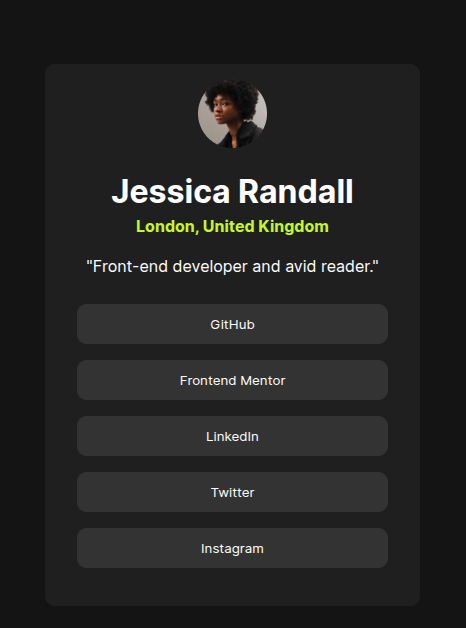

# social-links-profile

This is a solution to the [Social Links Profile challenge on Frontend Mentor](https://www.frontendmentor.io/challenges/social-links-profile-UG32l9m6dQ). Frontend Mentor challenges help you level up your frontend skills by building real-world projects.

---

## 📚 Table of Contents

- [📖 Overview](#-overview)
  - [🎯 The Challenge](#-the-challenge)
  - [🖼️ Screenshot](#-screenshot)
  - [🔗 Links](#-links)
- [🛠 My Process](#-my-process)
  - [🧱 Built With](#-built-with)
  - [📚 What I Learned](#-what-i-learned)
  - [🚀 Continued Development](#-continued-development)
  - [📌 Useful Resources](#-useful-resources)
- [🙋‍♂️ Author](#-author)
- [🙏 Acknowledgments](#-acknowledgments)

---

## 📖 Overview

### 🎯 The Challenge

Users should be able to:

- See hover and focus states for all interactive elements on the page  
- Click on social media links and get redirected to the correct profiles  
- Experience a responsive layout on different screen sizes

---

### 🖼️ Screenshot



---

### 🔗 Links

- 💻 **Solution URL:** [View code on GitHub](https://github.com/Michael-Okorie/social-links-profile.git)
- 🌐 **Live Site URL:** [Check out the live site](https://michael-okorie.github.io/social-links-profile/)

---

## 🛠 My Process

### 🧱 Built With

- Semantic **HTML5** markup
- **CSS Custom Properties**
- **Flexbox** & **CSS Grid**
- **Mobile-first** responsive design

---

### 📚 What I Learned

This project gave me a solid refresher on building clean, accessible UI components and handling responsive design. Here are a few things I’m proud of:

```css

button{
    width: 90%;
    padding: 12px;
    border: none;
    background-color: var(--Grey700);
    color: var(--White);
    border-radius: 10px;
    margin: 8px;
    cursor: pointer;
    transition: all 0.5s ease-in-out;
    font-family: "Inter";
}

```

## 🚀 Continued Development

I want to continue sharpening my skills in:

- Creating fully accessible components   
- Perfecting responsive UI design  

---

## 📌 Useful Resources

- [MDN Web Docs](https://developer.mozilla.org/) – The go-to reference for HTML/CSS/JS  
- [CSS Tricks - Flexbox Guide](https://css-tricks.com/snippets/css/a-guide-to-flexbox/) – Best visual reference for layout   

---

## 🙋‍♂️ Author

- Github – [Michael Okorie](https://github.com/Michael-Okorie)  
- Frontend Mentor – [@Michael-Okorie](https://www.frontendmentor.io/profile/Michael-Okorie)  
- Twitter – [@Dev_Michael_](https://x.com/Dev_Michael_)  

---

## 🙏 Acknowledgments

Huge thanks to the **Frontend Mentor** community for the endless support and feedback! 🙌


